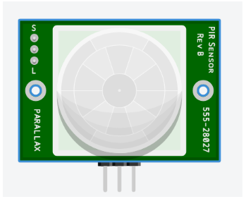
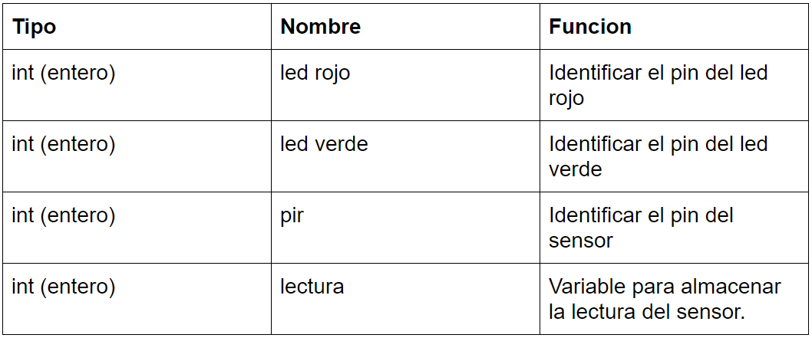
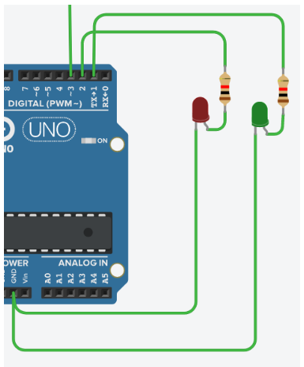
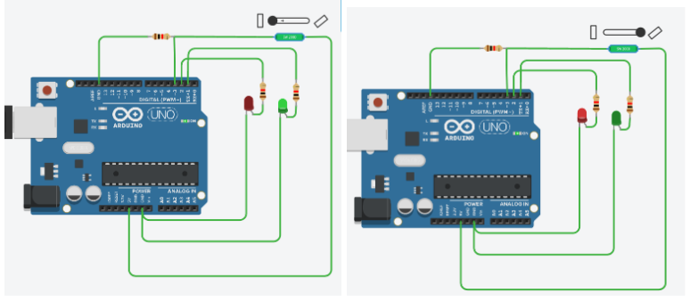

# Sensores Arduino

## 1. Planteamineto del problema
 - Reconocer e Implementar mediante la plataforma de TinkerCAD una serie de sensores para el arduino Uno e investigar sus diferentes usos, los cuales se pretende llevar a la práctica.

## 2. Objetivos
- **General**
  - Analizar los distintos sensores existentes para Arduino en tinkercad, sus características y tipos.
- **Específicos**
  - Identificar la función y uso específico de cada sensor.
  - Conocer los tipos de sensores existentes en el mercado y diferenciarlos entre sí.
  - Desarrollar ejemplos prácticos básicos para cada uno de los tipos de sensores analizados.

## 3. Estado del Arte


En lo que respecta a nuestro Investigación cada una de estas investigaciones tienen aportaciones generales como lo son:

 - Los sensores nos facilitan y ayudan en el desarrollo de temas como lo son la salud, seguridad e innovación, ya que nos permiten  desarrollar sistemas de automatización más eficientes.
 - El uso de Arduino no solo nos permite monitorear los sensores, sino darles una aplicación útil en conjunto con otros dispositivos.
 - Al contar con una infinidad de aspectos en nuestro entorno se puede también contar con una infinidad de sensores los cuales van a tener su control y configuración las cuales se adaptan fácilmente a nuestras necesidades.
 
## 4. Marco Teórico
Para poder entender con precisión el tema de  los sensores de Arduino existe un apartado teórico el cual nos servirá como guía y base para proceder con los diferentes proyectos que se desee realizar.
 
**¿Qué es un sensor?**

 Un sensor es un dispositivo capaz de detectar magnitudes físicas o químicas, llamadas variables de instrumentación, y transformarlas en variables eléctricas.

Un sensor es un dispositivo capaz de detectar magnitudes físicas o químicas, llamadas variables de instrumentación, y transformarlas en variables eléctricas.

Una magnitud eléctrica puede ser una resistencia eléctrica (como en una RTD), una capacidad eléctrica (como en un sensor de humedad o un sensor capacitivo), una tensión eléctrica (como en un termopar), una corriente eléctrica (como en un fototransistor), etc.
Existen diversos tipos de sensores, pero los antes mencionados si tienen una versión compatible con Arduino, siendo de gran utilidad dependiendo el proyecto en el que se quiera trabajar. 

Estos sensores se pueden clasificar en función de los datos de salida en:
- Digitales
- Analógicos

**Sensores Digitales**

Los sensores digitales son aquellos dispositivos que únicamente pueden adoptar valores de salida 1 y 0 que muchas veces representan un encendido y un apagado o un “si” y un “no”, los estados de un sensor digital son absolutos y únicos y por lo general se usa en situaciones donde se quiere verificar estados de “verdad” o “falsedad o negación”. 
También se debe considerar que en caso que el sensor use comunicación por bus, deberemos usar algunos de los buses que implementa Arduino o usar hardware adicional que nos proporcione un interfaz entre el Arduino y el bus.

**Sensores Analógico**

Los sensores analógicos son aquellos que como salida emiten una señal comprendida por un campo de valores instantáneos que varian en el tiempo y son proporcionales a los efectos que se están midiendo. 
Un ejemplo de un sensor analógico usado en la placa Arduino es el ACS714, es un sensor de efecto hall que mide las corrientes eléctricas que pasan a través del chip y devuelve un valor en voltaje proporcional a la corriente que circula por el sensor.

**Características de  los sensores**
**Rango de medida:** dominio en la magnitud medida en el que puede aplicarse el sensor.
**Precisión:** es el error de medida máximo esperado.

**Offset o desviación de cero:** valor de la variable de salida cuando la variable de entrada es nula. Si el rango de medida no llega a valores nulos de la variable de entrada, habitualmente se establece otro punto de referencia para definir el offset.

**Linealidad o correlación lineal**

**Sensibilidad de un sensor:** suponiendo que es de entrada a salida y la variación de la magnitud de entrada.

**Resolución:** mínima variación de la magnitud de entrada que puede detectarse a la salida.

**Rapidez de respuesta:** puede ser un tiempo fijo o depender de cuánto varíe la magnitud a medir. Depende de la capacidad del sistema para seguir las variaciones de la magnitud de entrada.

**Derivas:** son otras magnitudes, aparte de la medida como magnitud de entrada, que influyen en la variable de salida. Por ejemplo, pueden ser condiciones ambientales, como la humedad, la temperatura u otras como el envejecimiento (oxidación, desgaste, etc.) del sensor.

**Repetitividad:** es el error esperado al repetir varias veces la misma medida.

**Tipos de sensores utilizados**
 - Sensor de luz de ambiente

Es un sensor que nos va a permitir medir la luz en el entorno donde tengamos realizado nuestro montaje, de tal forma que podamos decidir qué acciones a realizar en función de los umbrales de luz u oscuridad que estimemos oportuno.  

Un ejemplo de este tipo de sensores es el LDR o fotoresistor.


**Sensor PIR** 

Los sensores PIR se basan en la medición de la radiación infrarroja. Todos los cuerpos (vivos o no) emiten una cierta cantidad de energía infrarroja, mayor cuanto mayor es su temperatura. Los dispositivos PIR disponen de un sensor piro eléctrico capaz de captar esta radiación y convertirla en una señal eléctrica.
En realidad cada sensor está dividido en dos campos y se dispone de un circuito eléctrico que compensa ambas mediciones. Si ambos campos reciben la misma cantidad de infrarrojos la señal eléctrica resultante es nula. Por el contrario, si los dos campos realizan una medición diferente, se genera una señal eléctrica.
De esta forma, si un objeto atraviesa uno de los campos se genera una señal eléctrica diferencial, que es captada por el sensor, y se emite una señal digital, que es lo que realmente se ha de evidenciar al simular en Arduino.


**Sensor de distancia**

Un sensor de ultrasonidos, es un dispositivo para medir distancias. Su funcionamiento se basa en el envío de un pulso de alta frecuencia, no audible por el ser humano. Este pulso rebota en los objetos cercanos y es reflejado hacia el sensor, que dispone de un micrófono adecuado para esa frecuencia.
Midiendo el tiempo entre pulsos, conociendo la velocidad del sonido, podemos estimar la distancia del objeto contra cuya superficie impacto el impulso de ultrasonidos
Los sensores de ultrasonidos son sensores baratos, y sencillos de usar. El rango de medición teórico del sensor HC-SR04 es de 2cm a 400 cm, con una resolución de 0.3cm. En la práctica, sin embargo, el rango de medición real es mucho más limitado, en torno a 20cm a 2 metros.


**Sensor de Inclinacion(TILT)**

Un sensor de inclinación es un dispositivo que proporciona una señal digital en caso de que su inclinación supere un umbral. Este tipo de sensor no permite saber el grado de inclinación del dispositivo, simplemente actúa como un sensor que se cierra a partir de una cierta inclinación.
En la actualidad, por motivos medioambientales, casi todos los sensores de mercurio han sido desplazados por sensores TILT de doble esfera. Se dispone de un cilindro cuya pared constituye un contacto eléctrico, mientras que el otro contacto está localizado en el centro de la base. Al inclinar lo suficiente el dispositivo ambas esferas constituyen un puente entre ambos contactos, cerrando el circuito.


**Sensor de Temperatura**

Un sensor de temperatura es un componente que recoge la temperatura y/o humedad del exterior y lo transforma en señal digital o electrónica que envía a una placa electrónica como puede ser una placa Arduino. Existen muchos tipos de sensores y para muchos ámbitos.
En el caso del sensor TMP es un sensor de temperatura en grados centígrados de precisión y bajo voltaje


**Sensor de Gas**

Los sensores de gases MQ son una familia de dispositivos diseñados para detectar la presencia de distintos componentes químicos en el aire. Podemos conectar estos dispositivos a un autómata o procesador como Arduino.
Existe una gran variedad de sensores MQ. Cada modelo está diseñado para detectar una o más sustancias, pensadas para un uso específico, como por ejemplo detección gases inflamables, calidad del aire o detección de alcohol en aire respirado. Pueden proporcionar una salida de tipo analógico y de tipo digital, en este caso se usara una salida de tipo analógica.


**Escalar sensores en Arduino**
Cuando entra un voltaje analógico en un pin analógico de Arduino, este hace la conversión de analógico a digital (ADC). Quiere decir que convierte el voltaje de entrada 0-5V en valores enteros comprendidos entre 0-1023. Para entender este valor, hay que saber que las entradas analógicas de Arduino son de 10 bits. Tal como sabemos, un bit puede ser 1 o 0 (dual). Con un nombre n de bits se pueden representar hasta 2nvalores digitales. En el caso de las entradas analógicas de Arduino:   210 = 1024 valores (de 0 a 1023)


El siguiente paso es convertir estos valores nuevamente a voltaje en el código de Arduino. Para esto se tiene que multiplicar el valor leído del pin analógico por 5 (que son los 5V máximo que da el sensor) y dividirlo entre 1023 (que es el valor más grande dentro del rango de 10 bits). La fórmula sería la siguiente:


De este modo, tenemos relacionado el voltaje de salida del sensor con los valores digitales de Arduino.


De esta manera podemos adecuar los valores de entrada analógica a los que realmente vayamos a necesitar interpretar en nuestro proyecto con sensores.

## 5.Diagramas
**Sensor PIR**

Para el siguiente sensor simularemos un circuito que en el momento que detecte movimiento a su alrededor encienda un led de color rojo que indique alerta, pero si no detecta movimiento pues se encendera un led de color verde.
El circuito contará con un sensor PIR  555-28027 el cual trabaja con las siguientes señales:



El pin de la derecha es para comunicarnos con el microcontrolador, en este caso arduino, el sensor usado trabaja con señales digitales por lo que si detecta movimiento en su rango de operación enviará un 1 lógico, caso contrario envía un 0 lógico.
El pin central es para la señal de alimentación, en este caso de 5v.
El pin de la derecha es para GND.


**Sensor de Inclinacion**

Simularemos un circuito que determine cuándo una superficie está inclinada en caso de estar inclinada se encenderá un led rojo, en caso de estar nivelada se encenderá un led verde.
El sensor a usar es el SW200D que funciona a manera de interruptor es decir se cierra o se abre dependiendo de la inclinación del sensor.


**Sensor de Gas**

En el siguiente circuito simularemos un detector de gas donde se tendra 3 niveles de peligro segun el nivel de gas en el ambiente, donde el encendido de un diodo rojo signifique peligro, amarillo alerta o precaucion y verde calma. Para este circuito se usará el sensor de gas predeterminado por tinkercad de 6 pines.


El circuito cuenta con 3 salidas correspondientes a los diodos y una entrada correspondiente al sensor el cual envía valores analogicos, por lo que usaremos uno de los pines analogicos de nuestro Arduino. También tendremos una resistencia para el sensor de 4,7k para protección del mismo además que de esta dependerá los valores para nuestro escalonamiento.


**Sensor de temperatura**

En el siguiente circuito se implemente un sensor de temperatura que va a encender cada led dependiendo de la temperatura que que detecte el sensor para c°<=15 Led azul, c°>=16 y c°<=29 Led verde, c°>=30 y c°<=49 Led amarillo, c°>=50 Led rojo
los valores ingresaran desde el sensor al arduino por la entrada analogica A1.


**Sensor de Luz de ambiente**

En el siguiente circuito se implemente un sensor de luz ambiente
que va a encender cada led dependiendo de la temperatura que que detecte el sensor para menor a val<=600 Led verde, val>=601 y val<=799 Led amarillo, val>=800 y val<=999 Led azul, val>=1000 Led blanco
los valores ingresarán desde el sensor al arduino por la entrada analogica A1.


**Sensor de Distancia(HC-SR04)**

En el siguiente circuito se implemente un sensor de distancia ultrasónico que dependiendo a la distancia que se encuentre el objetivo se irán encendiendo o apagando los leds


## 6. Lista de Componentes
### Simulación detección de movimiento (PIR)
- 1 Sensor PIR 555-28027
- 1 Diodo rojo
- 1 Diodo verde
- 1 Arduino UNO

### Simulación detección de inclinación con sensor SW-200D
- 1 Sensor SW-200D
- 1 Diodo rojo
- 1 Diodo verde
- 1 Arduino UNO
- 3 Resistencias 1k

### Simulación detección de gas 
- 1 Sensor de gas
- 1 Diodo rojo
- 1 Diodo amarillo
- 1 Diodo verde
- 1 Arduino UNO
- 3 Resistencias 1k
- 1 Resistencia de 4.7k

### Simulación detección de temperatura
- 1 Sensor de temperatura
- 1 Diodo rojo
- 1 Diodo amarillo
- 1 Diodo verde
- 1 Diodo azul
- 1 Arduino UNO
- 4 Resistencias 1k

### Simulación detección de Luz de ambiente
- 1 Sensor de luz ambiente
- 1 Diodo blanco
- 1 Diodo azul
- 1 Diodo naranja
- 1 Diodo verde
- 1 Arduino UNO
- 5 Resistencias 1k

### Simulación detección de distancia ultrasonica
- 1 Sensor de distancia ultrasonico(HS-SR04)
- 1 Diodo rojo
- 1 Diodo amarillo
- 1 Diodo verde
- 1 Diodo azul
- 1 Arduino UNO
- 3 Resistencias 1k

## 7. Mapa de Variables
**Simulación detección de movimiento (PIR)**



**Simulación detección de inclinación con sensor SW-200D**


**Simulación detección de gas**


**Simulacion detección de Temperatura**


**Simulacion detección de luz de ambiente**


**Simulacion detección de distancia**


## 8. Explicacion de codigo fuente
**Simulación detección de movimiento (PIR)**
```
//declaracion de pines
int lrojo=6;//led rojo
int lverde=5;//led verde
int pir=2;//pin del sensor pir
int lectura;//variable para leer el sensor

void setup()
{
	pinMode(lrojo,OUTPUT);
	pinMode(lverde,OUTPUT);
	pinMode(pir,INPUT);
}

void loop()
{
lectura=digitalRead(pir);//lectura del sensor
if (lectura==HIGH)//caso de movimiento detectado
{
	digitalWrite(lrojo,HIGH);
	digitalWrite(lverde,LOW);
}else//caso de no deteccion de movimiento
{
	digitalWrite(lrojo,LOW);
	digitalWrite(lverde,HIGH);
}
}
```
**Sensor de inclinación SW-200D**
```
//Declaracion de variables
int sensor=3;//PIN 3 SENSOR
int diodoRojo=2 ;//PIN DEL DIODO ROJO
int diodoVerde=1;//PIN DEL DIODO VERDE

void setup()
{
  //configuracion de pines
    pinMode(sensor,INPUT);//sensor como entrada
	pinMode(diodoRojo,OUTPUT);//diodos como salidas
	pinMode(diodoVerde,OUTPUT);
}

void loop()
{

    if (digitalRead(sensor)==LOW)//caso de nivel recto
	{
    	digitalWrite(diodoVerde,HIGH);
    	digitalWrite(diodoRojo,LOW);
	}else
	{
    	digitalWrite(diodoVerde,LOW);// caso de inclinación
    	digitalWrite(diodoRojo,HIGH);
	}
}
```
**Simulación detección de gas**
```
//DECLARACIÓN DE VARIABLES
int ledrojo=2;//PIN 2 CORRESPONDIENTE AL LED ROJO
int ledamarillo=3;//PIN 3 CORRESPONDIENTE AL LED ROJO
int ledverde=5;//PIN 5 CORRESPONDIENTE AL LED ROJO
int sensor=A0;//PIN A0 CORRESPONDIENTE AL LED ROJO
int valor;//VARIABLE DE LECTURA SENSOR
void setup()
{
      //DECLARACION DE SALIDAS
    pinMode(ledrojo,OUTPUT);
	pinMode(ledamarillo,OUTPUT);
	pinMode(ledverde,OUTPUT);
      //INICIO DE COMUNICACION SERIAL
    Serial.begin(9600);
}

void loop()
{

	valor=analogRead(sensor);//LECTURA DE VALORES ANALOGICOS DEL SENSOR
	valor=map(valor,300,750,0,100);//ESCALADO DEL SENSOR MEDIANTE MAPEO
      Serial.println(valor);//IMPRESION DE VALORES EN MONITOR DE COMPUTADOR
	if (valor<=33.33)//CASO PARA VALORES MENORES DEL %33 DE HUMO
	{
    	digitalWrite(ledrojo,LOW);
    	digitalWrite(ledamarillo,LOW);
    	digitalWrite(ledverde,HIGH);
   }else if (valor<=66.66)//CASO PARA VALORES ENTRE %33 Y %66 DE HUMO
	{
    	digitalWrite(ledrojo,LOW);
    	digitalWrite(ledamarillo,HIGH);
    	digitalWrite(ledverde,LOW);
	}else//CASO PARA VALORES MAYORE DEL %66 PORCIENTO DE HUMO
	{
    	digitalWrite(ledrojo,HIGH);
    	digitalWrite(ledamarillo,LOW);
    	digitalWrite(ledverde,LOW);
	}
	 
}
```
**Simulacion deteccion de temperatura**
```
int val=0;
void setup()
{
  Serial.begin(9600);
}

void loop()
{
  val= analogRead(1);
  float c=(val-102)/2;
  Serial.print("temp");
  delay(100);
    
  if(c<=15){
    
    digitalWrite(5,HIGH);
  
  }else {
    digitalWrite(5,LOW);
  }
  
  if(c>=16&&c<=29){
    
    digitalWrite(4,HIGH);
  
  }else {
    digitalWrite(4,LOW);
  }
  
  if(c>=30&&c<=49){
    
    digitalWrite(3,HIGH);
  
  }else {
    digitalWrite(3,LOW);
  }
  
  if(c>=50){
    
    digitalWrite(2,HIGH);
  
  }else {
    digitalWrite(2,LOW);
  }
  
}
```
**Simulacion deteccion luz ambiental**
```
int val=0;
void setup()
{
  Serial.begin(9600);
}

void loop()
{
  val= analogRead(1);
  Serial.print(val);
  delay(100);
  
  if(val<=600){
    
    digitalWrite(5,HIGH);
  
  }else {
    digitalWrite(5,LOW);
  }
  
  if(val>=601&&val<=799){
    
    digitalWrite(4,HIGH);
  
  }else {
    digitalWrite(4,LOW);
  }
  
  if(val>=800&&val<=999){
    
    digitalWrite(3,HIGH);
  
  }else {
    digitalWrite(3,LOW);
  }
  
  if(val>=1000){
    
    digitalWrite(2,HIGH);
  
  }else {
    digitalWrite(2,LOW);
  }
}
```
**Simulacion deteccion de distancia**
```
long cm = 0;

long readUltrasonicDistance(int triggerPin, int echoPin)
{
  pinMode(triggerPin, OUTPUT);
  digitalWrite(triggerPin, LOW);
  delayMicroseconds(2);
  digitalWrite(triggerPin, HIGH);
  delayMicroseconds(10);
  digitalWrite(triggerPin, LOW);
  pinMode(echoPin, INPUT);
  return (pulseIn(echoPin, HIGH)*0.01723);
  
}

void setup()
{
  Serial.begin(9600);

  pinMode(2, OUTPUT);
  pinMode(3, OUTPUT);
  pinMode(4, OUTPUT);
}

void loop()
{
  cm =readUltrasonicDistance(7, 6);

  Serial.print(cm);
  Serial.println("cm");
  
  if (cm > 250) {
    digitalWrite(2,LOW);
    digitalWrite(3,LOW);
    digitalWrite(4,LOW);
  }
  if (cm <= 250 && cm > 175) {
    digitalWrite(2,HIGH);
    digitalWrite(3,LOW);
    digitalWrite(4,LOW);
  }
  if (cm <= 175 && cm > 100) {
    digitalWrite(2,HIGH);
    digitalWrite(3,HIGH);
    digitalWrite(4,LOW);
  }
  if (cm <= 100) {
    digitalWrite(2,HIGH);
    digitalWrite(3,HIGH);
    digitalWrite(4,HIGH);
  }


  delay(100);
}
```

## 9. Descripción de Prerrquisitos y configuracion

**Simulación detección de movimiento (PIR)**

Al usar software de TinkerCAD no es necesario realizar ninguna configuración previa de ningún dispositivo lo único que necesitaremos es acceso a internet y cualquier dispositivo donde se nos haga fácil diseñar.
En caso de implementarlo de manera funcional no debemos configurar el sensor ya que solo enviará señales lógicas en caso de detección de movimiento. 

**Sensor de inclinación SW-200D**

Al usar software de TinkerCAD no es necesario realizar ninguna configuración previa de ningún dispositivo lo único que necesitaremos es acceso a internet y cualquier dispositivo donde se nos haga fácil diseñar.
En caso de implementarlo de manera funcional no debemos configurar el sensor funciona a manera de interruptor por lo que no necesita polarización.

**Simulación detección de gas**

Al usar software de TinkerCAD no es necesario realizar ninguna configuración previa de ningún dispositivo lo único que necesitaremos es acceso a internet y cualquier dispositivo donde se nos haga fácil diseñar.
En caso de implementarlo de manera funcional debemos realizar un escalado para el sensor de gas ya que dependiendo de la resistencia que le coloquemos, este nos entregará un valor analogico de voltaje. Esto lo podemos hacer con el Arduino creando un código que lea el pin analogico de entrada y que nos muestre en una computadora mediante la comunicación serial.

**Sensor de temperatura**

Al usar software de TinkerCAD no es necesario realizar ninguna configuración previa de ningún dispositivo lo único que necesitaremos es acceso a internet y cualquier dispositivo donde se nos haga fácil diseñar.En este se tiene en cuanta la formula para los daros que envia el sensor hacia el arduino.

**Sensor de Luz ambiente**

Al usar software de TinkerCAD no es necesario realizar ninguna configuración previa de ningún dispositivo lo único que necesitaremos es acceso a internet y cualquier dispositivo donde se nos haga fácil diseñar.Para este circuito debemos tener en cuenta el usar una resistencia en el sensor para evitar que se funda.

**Sensor de distancia ultrasonico(HS-SR04)**

Al usar software de TinkerCAD no es necesario realizar ninguna configuración previa de ningún dispositivo lo único que necesitaremos es acceso a internet y cualquier dispositivo donde se nos haga fácil diseñar.Para estoy hay que tener en cuenta las 2 lineas de datos del sensor.

## 10. Aportaciones
**Sensores y Arduino emulados con proteus**

Proteus es un software de simulación de circuitos que cuenta con una gran cantidad de componentes electrónicos a nuestra disposición. Dentro de estos componentes contamos también con distintos sensores que vienen incluidos de manera predeterminada en el programa y podemos agregar más mediante distintas librerías disponibles.
El simular los circuitos en proteus es distinto a tinkercad ya que normalmente en proteus trabajamos con simbología o diagramas mientras que en tinkercad trabajamos con gráficas físicas de los componentes. Pero la ventaja de proteus es que tenemos formas de conexión más completas ya que incluso podemos modificar características de algunos componentes y la posibilidad de conectar mediante nodos.


A continuación mostraremos cómo poder simular uno de nuestros circuitos mediante proteus.
Primeramente debemos tener instalado una librería de arduino. Si no disponemos la podemos descargar de internet e instalarla dentro de nuestra carpeta de librerías de proteus.


Una vez con nuestra librería procedemos a realizar nuestra simulación, para este caso realizaremos el sensor de temperatura.
Primero debemos crear un proyecto con las características que consideremos necesarias. 
Después debemos buscar todos nuestros componentes mediante el buscador de proteus, este estará identificado con la letra P y buscar los distintos elementos de nuestro circuito.
Una vez encontrados cada componente debemos seleccionar ok para agregarlos a nuestro entorno de trabajo.


Requerimos de una alimentación por lo que al usar un sensor lm35 podemos trabajar tranquilamente con una fuente de 5 voltios.
Para la librería que usamos no es necesario alimentar el arduino.
Para ubicar en nuestro diagrama cada componente solamente debemos arrastrarlo del cuadro de selección.


Una vez ubicados nuestros componentes debemos conectarlos, como se mencionó anteriormente no es necesario conectarlos pin con pin ya que también podemos conectarlos mediante nodos.


Para ingresar nuestro código debemos generarlo en la IDE de Arduino ya que cuando este compile generará un archivo .hex que debemos cargar en proteus.
Este lo podemos ver en el recuadro negro inferior donde necesitaremos la ubicacion del archivo.


Dando click en el arduino de nuestra simulación agregamos la dirección de nuestro programa en program file.


Una vez ya creado el circuito e ingresado el código probamos con el botón play.


## 11. Conclusiones
Una vez que ya se ha concluido con los proyectos con los diversos sensores que se había propuesto, pudimos notar que sus características son similares en cuanto a  protocolo de programación se refiere, sin embargo existen diferencias en su funcionalidad ya que depende el motivo para el cual estén destinados el comportamiento que los sensores vayan a tomar y también se pueden diferenciar en su complejidad operacional, como claro ejemplo se puede tomar las diferencias de un sensor ultrasónico y un sensor de temperatura los cuales están separados por un nivel de complejidad, siendo el sensor ultrasónico un tanto más complicado debido a el tipo de escala que se debe interpretar.
 
Además con los ejemplos prácticos realizados nos podemos dar una idea de cómo podríamos implementar este tipo de sensores en un uso diario dependiendo de la necesidad que nos aqueja en el día a día.

También con los trabajos realizados tanto de investigación como de práctica pudimos estimar los tipos de sensores que más se debe usar en el mercado debido a su utilidad en el campo de la seguridad y de la prevención, campos en los que se utiliza sensores como el  PIR y el sensor de gas, y campos de la información pública y de investigación donde usan sensores como el de temperatura y el de luz ambiental.

De esta manera finalmente podemos concluir que se ha podido analizar, identificar, estimar y desarrollar las diversas actividades planteadas al inicio de nuestro proyecto.

## 12. Recomendaciones
 - Debemos tener en cuenta siempre que cuando trabajamos con sensores analogicos realizar un escalado previo con el Arduino para determinar los valores reales que interpretará nuestro Arduino.
 - En el mercado existen varios tipos de sensores que miden una misma magnitud por lo que depende de nosotros seleccionar el que más se adapte a nuestras necesidades.

## 13. Cronograma


## 14. Bibliografia
Aditya, Sharma, M., & Gupta, S. C. (2018). An Internet of Things Based Smart Surveillance and Monitoring System using Arduino. Proceedings on 2018 International Conference on Advances in Computing and Communication Engineering, ICACCE 2018, (June 2018), 428–433. https://doi.org/10.1109/ICACCE.2018.8441725

Asha, K. R., Suhada Tasleem, P., Ravi Kumar, A. V., Mallikarjuna Swamy, S., & Rekha, K. R. (2017). Real Time Speed Control of a DC Motor by Temperature Variation Using LabVIEW and Arduino. Proceedings - 2017 International Conference on Recent Advances in Electronics and Communication Technology, ICRAECT 2017, 72–75. https://doi.org/10.1109/ICRAECT.2017.50

Singh, N. A., & Borschbach, M. (2017). Effect of external factors on accuracy of distance measurement using ultrasonic sensors. Proceedings - International Conference on Signals and Systems, ICSigSys 2017, 266–271. https://doi.org/10.1109/ICSIGSYS.2017.7967054

Cristhian Ruiz, (2017), sensor de Luz, Open Lanuza, recopilado de: https://openlanuza.com/senson-de-luz-con-arduino/
Omar Marcelo Magueño, (2018), Slide Share, recopilado de: https://es.slideshare.net/omarmarcelomagueogor/presentacion-sensores-digitales-y-analogicos

Arduino, Bus de Campo, Curso Iniciación 2018, Sensores y está etiquetada con Arduino, Bus de Campo, Curso Iniciación 2018, DHT, Sensor de Temperatura, Sensores, Sondas en 14 abril, 2018, recopilado de:  https://aprendiendoarduino.wordpress.com/2018/04/14/sensores-arduino-3/#:~:text=Un%20sensor%20es%20un%20dispositivo,y%20transformarlas%20en%20variables%20el%C3%A9ctricas.

Luis Llamas, (2015), MEDIR DISTANCIA CON ARDUINO Y SENSOR DE ULTRASONIDOS HC-SR04, ingniera, informática y diseño, recopilado de: https://www.luisllamas.es/medir-distancia-con-arduino-y-sensor-de-ultrasonidos-hc-sr04/

Luis Llamas (2015), DETECTOR DE MOVIMIENTO CON ARDUINO Y SENSOR PIR, ingeniería, informática y diseño, recopilado de: https://www.luisllamas.es/detector-de-movimiento-con-arduino-y-sensor-pir/#:~:text=Los%20sensores%20infrarrojos%20pasivos%20(PIR,potencia%2C%20y%20f%C3%A1ciles%20de%20usar.&text=Los%20dispositivos%20PIR%20disponen%20de,convertirla%20en%20una%20se%C3%B1al%20el%C3%A9ctrica.

Luis Llamas, (2015), MEDIR INCLINACIÓN CON ARDUINO Y SENSOR TILT SW-520D, ingeniería, informática y diseño, recopilado de: https://www.luisllamas.es/medir-inclinacion-con-arduino-y-sensor-tilt-sw-520d/#:~:text=Un%20sensor%20de%20inclinaci%C3%B3n%20es,partir%20de%20una%20cierta%20inclinaci%C3%B3n.

## 15. Anexos
Manuales de usuario

**Sensor PIR**

Para el siguiente circuito necesitaremos un Arduino, 1 diodo rojo, 1 diodo verde, 2 resistencias de 1k y un sensor PIR


Para la conexión de los diodos conectamos el cátodo a tierra y el ánodo con la resistencia de 1k para protegerlos del sobrevoltaje y las resistencias a los pines 5 y 6 que van a ser nuestras salidas.


El sensor contará con 3 pines los cuales conectaremos el izquierdo al pin 2 de nuestro Arduino, el del medio a Vcc y el derecho a GND.


Una vez conectados nuestros componentes, debemos agregar el siguiente código en nuestro Arduino.


Comprobamos el funcionamiento.


**Sensor de inclinación**

Para el siguiente circuito necesitaremos un Arduino, 1 diodo rojo, 1 diodo verde, 3 resistencias de 1k y un sensor SW-200D


Para la conexión de los diodos conectamos el cátodo a tierra y el ánodo con la resistencia de 1k para protegerlos del sobrevoltaje y las resistencias a los pines 1 y 2 que van a ser nuestras salidas.



El sensor funciona como interruptor, cuando se inclina se cerrará y cuando se encuentra estable se abre, por lo que debemos conectar el sensor con una resistencia de tal forma que envíe una señal digital que pueda ser interpretada por nuestro arduino.


Copiamos el siguiente código en nuestro Arduino.


Comprobamos el funcionamiento del circuito.



**Simulación deteccion de gas**

Para el siguiente circuito necesitaremos un Arduino, 1 diodo rojo, 1 diodo amarillo, 1 diodo verde, 3 resistencias de 1k, una resistencia de 4.7k y un sensor de gas.


Para la conexión de los diodos conectamos el cátodo a tierra y el ánodo con la resistencia de 1k para protegerlos del sobrevoltaje y las resistencias a los pines 2 para el rojo, 3 para el amarillo y 5 para el verde que van a ser nuestras salidas.


Al sensor primero deberemos realizar un escalado, esto lo podemos realizar fácilmente con el Arduino mediante un código que lea los valores analogicos que el sensor envía al Arduino y este a su vez mediante la comunicación serial los imprima en pantalla, y mediante distintas pruebas determinemos rangos de operación.


Cabe aclarar que los valores que envíe nuestro sensor depende también de la resistencia que le estemos conectando para el caso de una resistencia de 4.7k envía valores entre 300 y 750 por lo que en base a esos valores debemos escalar nuestro programa.
Para la conexión del sensor debemos conectar los pines superiores a VCC y los inferiores a: el de la izquierda a nuestro arduino, el de centro a GND y el de la derecha a una resistencia y de la resistencia a GND.


Comprobamos el funcionamiento.


**Simulación de Temperatura**

Para el siguiente circuito necesitaremos un Arduino, 1 diodo rojo, 1 diodo amarillo, 1 diodo verde, 1 dioso azul 4 resistencias de 1k y un sensor TMP 
Para las conexiones conectamos los anodos a tierra y los catodos a la resistencia para proteccion de sobrevoltaje y las resistencias a los pines 5,4,3,2 que son las salidas
El sensor cuenta con 3 salidas izquierda a un Vcc, derecho a un GND y el del centro a una de las entradas analogicas en este caso la A1


Ya conectados todo los componentes del cicuito agregamos el siguiente codigo en el Arduino.


Iniciamos la Simulacion para comporbar el funcionamiento.


**Simulación de Luz ambiente**

Para el siguiente circuito necesitaremos un Arduino, 1 diodo blanco, 1 diodo azul, 1 diodo naranja, 1 dioso verde 5 resistencias de 1k y un sensor Luz ambiental 
Para las conexiones conectamos los anodos a tierra y los catodos a la resistencia para proteccion de sobrevoltaje y las resistencias a los pines 5,4,3,2 que son las salidas
El sensor cuenta con 2 salidas izquierda a un Vcc, derecho a un GND y de la izquierda mandamos a las entradas analogicas en este caso la A1


Ya conectados todo los componentes del cicuito agregamos el siguiente codigo en el Arduino.


Iniciamos la Simulacion para comporbar el funcionamiento.


**Simulacion de Distancia**

Para el siguiente circuito necesitaremos un Arduino, 1 diodo rojo, 1 diodo amarillo, 1 dioso verde 3 resistencias de 1k y un sensor de distancia ultrasonico(HC-SR04) 
Para las conexiones conectamos los anodos a tierra y los catodos a la resistencia para proteccion de sobrevoltaje y las resistencias a los pines 7,6,4,3,2 que son salidas
El sensor cuenta con 4 salidas izquierda a un Vcc, derecho a un GND y de la izquierda centro TRIG entrada 7,centro ECHO entrada 6


Ya conectados todo los componentes del cicuito agregamos el siguiente codigo en el Arduino.


Iniciamos la Simulacion para comporbar el funcionamiento.


